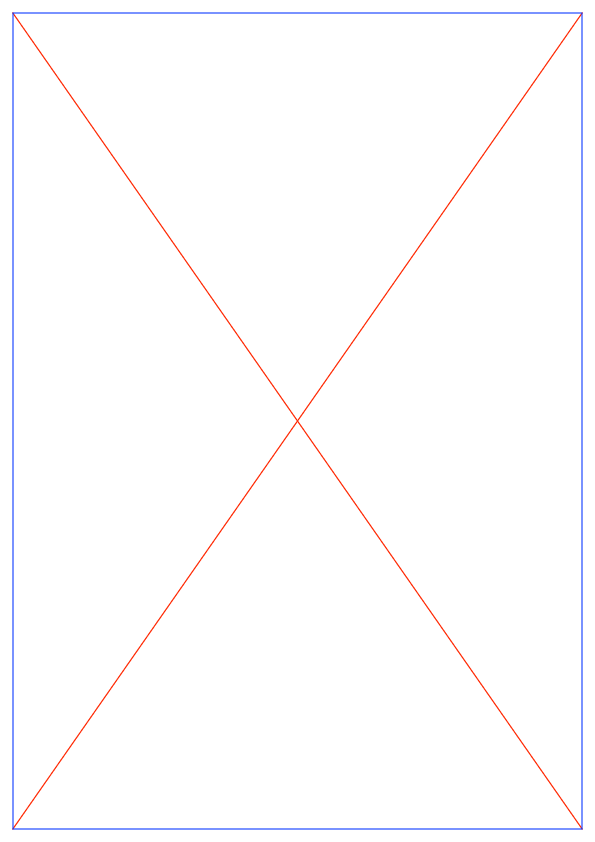

The Carneades model of argumentation
====================================

The `Python carneades project <https://github.com/ewan-klein/carneades>`_ is
an implementation of the `Carneades argumentation model
<http://carneades.github.io/carneades/Carneades/>`_. It closely
follows the Haskell `Carneades DSL
<http://www.cs.nott.ac.uk/~bmv/CarneadesDSL>`_ by Bas van Gijzel and
Henrik Nilsson, especially `this detailed code
<http://www.cs.nott.ac.uk/~bmv/Code/CarneadesDSLWithCycleChecking.lhs>`_
(also available in a more readable LaTeX-ed :download:`PDF
<CarneadesDSL.pdf>` version).

For more detailed module documentation, see the `API documentation <api/index.html>`_.

The main module ``caes.py`` uses the ``igraph`` package for
representing dependencies between arguments. For documentation, see

* `igraph tutorial <http://igraph.org/python/doc/tutorial/>`_
* `igraph manual and API
  <http://igraph.org/python/doc/igraph-module.html>`_

Plotting in ``igraph`` is dependent on the ``pycairo`` library which provides Python
bindings to the `Cairo library <http://www.cairographics.org>`_, as
illustrated below.

.. toctree::
   :hidden:
  
   api/index
 

